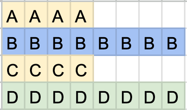
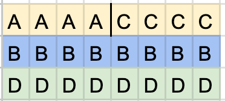

Arrays in C are actually just sequential data items stored qat some location in memory. The address of the array is the same as the address of the first item in the arrays, because it is where the array begins. The name of the arrays is also the address of the array.

~~~c
int main()
{
  char str1[] = "Hello world";
  printf("%s %c %d %d %d\n", str1, str1[0], &str1, &str1[0], str1);
  return 0;
}
~~~

The output of this program is the following

~~~
Hello world H 268740 268740 268740
~~~

## %D OR %P WHEN DISPLAYING POINTER VALUES?
We could notice from the previous example that we used the deciaml format specifier (`%d`) when displaying pointer values in strings, like this:

~~~c
printf("%d", ptr);
~~~

Whereas it is usually the convention to use the `%p` format specifier.

So which should you use? The simple answer is that `%p` is considered to be the standard format specifier for pointers. A pointer value is a number. It is a number that represents an address. That number can be displayed in any numeric format. The `%p` specifier displays it in hexadecimal format.

~~~c
printf( "%x, %x, %x", 105, 110, 115);
~~~

This shows these values.

~~~
69, 6e, 73
~~~

In fact, we could even use the `%p` specifier in this case, which would display the same hex values formatted differently.

~~~c
printf( "%p, %p, %p", 105, 110, 115);
~~~

~~~
00000069, 0000006E, 00000073
~~~

Now, let us look at this program:

~~~c
#include <stdio.h>
int main(int argc, char **argv)
{
  int *p;
  int a[] = {100,200,300,400};
  p = a;
  for (int i = 0; i < 4; i++){
    printf("Value = %d, Address = %p\n", *p, p);
    p = p + 1;
  }
}
~~~

At each iteration, the value of the pointer is incremented by 4 bytes (the size of an integer). This is the output in hexadecimal (using the %p specifier):
~~~
Value = 100, Address = 0028FF08
Value = 200, Address = 0028FF0C
Value = 300, Address = 0028FF10
Value = 400, Address = 0028FF14
~~~

But if I change the code to use the `%d` specifier, like this:

~~~c
printf("Value = %d, Address = %d\n", *p, p);
~~~

Now, this is the output:

~~~
Value = 100, Address = 2686728
Value = 200, Address = 2686732
Value = 300, Address = 2686736
Value = 400, Address = 2686740
~~~

This time, anyone can easily see that each address has been incremented by 4. 

### Arrays, addresses and pointers

## Array variables are not exactly the same as char pointer variables
Let us look at this example.

~~~c
int main()
{
  char str1[] = "Hello";
  char *str2 = "Goodbye";

  printf("%d %d %s\n", &str1, str1, str1);
  printf("%d %d %s\n", &str2, str2, str2);
}
~~~

The output should be something like this

~~~
2686746 2686746 Hello
2686740 4206628 Goodbye
~~~

As you can see when displayed as an integer value, the address of `str1` returned by the address operator is the same as the value of the variable `str1` itself. That's because `str1` is an array and an array is in effect an address.

But the address of `str2` returned by the address operator is different from the value of the `str2` variable. The address gives us the location in memory of the pointer variable `str2`. But the value of that variable is the address of the array of chars to which it points.

## Multiple indirection and command line arguments
We will often find that the main function of a C program declares the argument argv preceded by `**`. That means it is a pointer to a pointer to a char. The argc arguemnt gives us the number or count of arguments, while the arg argument is initialized with any arguments passed at the command line. Te first argument is the program name itself, and subsequent arguments are any strings entered after.

# Memory allocating

## calloc vs malloc
The calloc function allocates memory, but it also clears the memory. In other words, it initializes the memory with nulls.
Uninitialized memory contains unknown data junk which you could accidentally try to use in your program if you allocate memory.

With calloc a series of nulls will be written into that memory until, of course, you specifically write some other data there.
If you are careful always to initialize allocated memory, then by all means use malloc.

The calloc function performs exactly the same function as malloc, but in addition it ensures that the allocated memory is initialized and that allows you to test the allocated memory if required, so that you know whether or not any specific data, the data that you intend it for has yet been written into that memory.

The only other difference to bear in mind is the syntax. Malloc takes a single argument which is the size in bytes of the memory required to hold all the data you want to store. Calloc takes two arguments The number of elements in the array and the size of each element. You can calculate the size using the `sizeof` operator.

Bear in mind that both malloc and calloc return a generic pointer. A pointer to void or a null pointer if the allocation of memory fails.

It's worth saying at this point what a null pointer actually is: It's nothing more nor less than a pointer whose value is zero. In other words, whereas other pointers store a number greater than zero, which is treated as an actual address in memory by convention, a pointer with the value zero is considered to be one that does not point to a valid address and we call a pointer with zero value a null pointer.

## free
Once memory is allocated, it's no longer available to the rest of your program. So in principle, if you continue to allocate chunks of memory, you might eventually run out of memory when there is no more left to be allocated.

Now, on modern desktop computers, this is rarely in fact the case because they simply have huge amounts of memory. Even so, if you allocated very large amounts of memory without ever freeing any up when it's no longer needed, you'd be using memory very inefficiently.

Keeping memory allocated even when it's not needed, that is when it's no longer referenced by any variables or pointers in your program, creates what are usually referred to as memory leaks.

This could be a real problem if you happen to be writing C programs for devices that don't have huge amounts of memory, for example, hardware controllers for machines or robotic devices, and they might have very small amounts of memory.

At any rate, it's good practice to deallocate memory to make it available again for use in your program when that memory is no longer needed.

And the usual way to do that in C is by calling the free function. 

~~~c
char* s;
s = (char*)calloc(10, sizeof(char));
strcat(s, "hello");
printf("%s", s);
free(s);
~~~

But be careful if you call free on a variable that was never allocated, or if you try to use allocated memory after you've called free, then your program will go horribly wrong.

## Pointer arithmetic
In some of the short programs we've looked at, we've iterated over the items in an array just by adding one to the pointer variable.

Since the value of a pointer is a number that represents an address in memory, **why does adding one to a pointer have the effect of moving it to the next element in an array?**

Maybe it's because it just increases the value by one byte, so it moves the pointer one byte in memory and that's where the next element in the array is stored. But know that that that simply doesn't make sense either. I know that my C compiler on windows needs four bytes for an integer, so it would seem that when I add one to my int pointer I actually move four bytes in memory to the next int in my array.

It's because C knows that an int takes up four bytes. And so it knows that when I add one to my pointer, what I mean to do is to increase the value of that pointer. That is to increment the address that it stores by, however many bytes are needed to move to the next element of an array.

## Pointers to structs
Let's look at this program that uses structs.
~~~c
#define COUNT 4

typedef struct {
  int a; // 4 bytes
  int c; // 4 bytes
  double b; // 8 bytes
  long long int d; // 8 bytes
} MYSTRUCT;

int main()
{
  MYSTRUCT *p, *q;
  void* v;

  printf("size of MYSTRUCT = %d\n", sizeof(MYSTRUCT));

  p = (MYSTRUCT*)calloc(COUNT, 24);
}
~~~

Here I've declared a struct containing two ints, a double and a long, long int. I've used these data types before and I know that each int takes up four bytes while the others take up eight bytes each. Add them together, I get 24 bytes.

~~~c
size of MYSTRUCT = 24
~~~

I print out the size of my struct and it says 24.
So when I want to allocate memory for an array of my structs, I just need to allocate 24 bytes for each struct

So what's the matter?

Well, it's not so much that it's absolutely wrong for the time being in the present case as the code stands at the moment.
But it is, at any rate, still a very, very bad idea.

We've already seen an example of that with a long int, which has a different size on my PC and on my Mac with more complex data types such as structs. **You should never assume that you know how much memory is actually required.**

Let's say I decide to reorder the fields of my struct. After all, C should logically come after B, shouldn't it? 
~~~c
typedef struct {
  int a; // 4 bytes
  double b; // 8 bytes
  int c; // 4 bytes
  long long int d; // 8 bytes
} MYSTRUCT;
~~~
Now, let's assume that I've written this program, tested it to see that it works as I've just done. And then at the end of the day, I just tidy up the struct as I've just done and I think no more about it. I send my program out into the world and when I get back to my desk the next morning, everyone's going nuts.

It turns out that is a change. And it's not a trivial change either, because, strange as it may seem, my struct no longer takes up 24 bytes of memory. It's now 32 bytes and that's why the program crashed when I tried to add more bytes per struct than I'd allocated.

This happens because of **Data alignment**

**This is why you should always use sizeof to calculate the actual size of a piece of data rather than assuming you know its size.**
~~~c
p = (MYSTRUCT*)calloc(COUNT, sizeof(MYSTRUCT));
~~~

## Data alignment
Let's look at the previous struct example again

~~~c
typedef struct {
  int a; // 4 bytes
  double b; // 8 bytes
  int c; // 4 bytes
  long long int d; // 8 bytes
} MYSTRUCT;
~~~

Imagine that I'm storing my struct in a matrix of cells like in a spreadsheet.

These data fields are arranged in memory, much as I've arranged them here in the spreadsheet. They form a nice, neat, regular matrix. It's not exactly the way that memory is arranged in your computer, but it might be a useful way to imagine it.

The fields of the struct are aligned so that they all start at a predefined boundary. Each eight byte data type needs to start at some multiple of eight bytes in memory from the start of the matrix.

The empty cells here on the right aren't used in fact, but they are important because they help to pad out the gap between the four byte int and the eight byte double. And that's how I ensure that the double starts on this eight byte boundary.

The empty cells, the ones shown on the right of the A and C ints, have been initialized with nulls.

---

But when I rearrange the field order by putting the two int fields one after the other.
~~~c
typedef struct {
  int a; // 4 bytes
  int c; // 4 bytes
  double b; // 8 bytes
  long long int d; // 8 bytes
} MYSTRUCT;
~~~

Well, that changes the structure of my the layout of my structure rather to something like this. The C compiler can now optimize the structure in memory instead of padding out the first int field A with extra bytes.

It just puts the next data field which is now another four byte int alongside A and that also forms now a nice neat matrix. This time no extra bytes are needed to align the eight byte data fields at eight byte boundaries.

So the matrix now takes eight fewer cells in my spreadsheet or eight fewer bytes in memory.