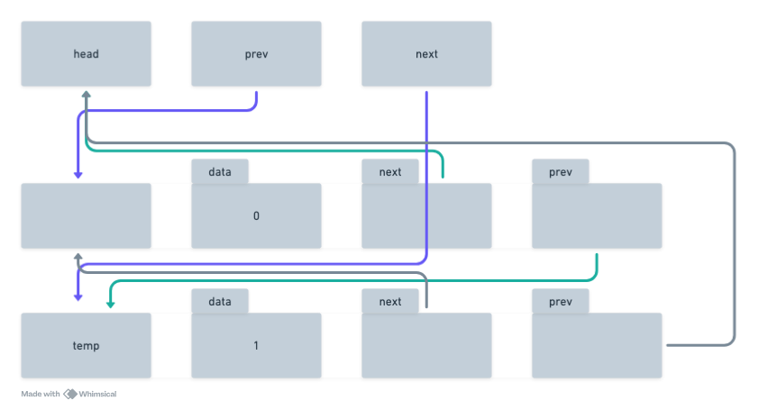

# Data Structures
Arrays are very convenient as they are simple to use, but they have some disadvantages. The most obvious of these is that an array has a fixed length. A workaround would be to create an array much bigger than I think I'll ever need, so i might declare an array cable of storing 100 elements, but only initialize it with 20. This is inefficient, and in any case, the estimate might be wrong.
One way around this problem is to create a linked list.

## Linked lists
With a linked list I don't allocate a fixed block of memory in advance. Instead, I allocate memory on an element by element basis. 

But since I'm adding and maybe deleting elements at various different points of my program, their locations in memory are likely to be all over the place. They don't occupy a single sequential block of memory like an array.

The first element in a linked list keeps a pointer to the next element. I can use the pointers stored in each element of the list to traverse it. 

### Singly linked list
In the file `01-linked-list.c`, we can see an example of a linked list of integers.

~~~c
typedef struct listitem
{
  struct listitem *next;
  int data
} LISTITEM;
~~~

First we declare a struct with fields to store some data: an int and a pointer. Note that the pointer points to a data item of the same type as the struct itself.

~~~c
LISTITEM *listhead, *temp;

listhead = NULL;
~~~
Inside main, we create two pointer variables: `listhead`, and `temp`, and set `listhead` to NULL.

~~~c
for (int i = 0; i < 3; i++)
{
  temp = malloc(sizeof(LISTITEM));
  temp -> data = i;
  temp -> next = listhead;
  listhead = temp;
}
~~~

So now we execute this for loop. What that does, it creates and initializes three list item structs allocating the correct amount of memory for each using `malloc`. We initialize the data field of each struct to the integer `i` and thus from 0 to 2 as the for loop executes.
Then we assign listhead to the structs `next` pointer.

At the first turn through the loop, this is what we have. At the end of the loop listhead is assigned the value of temp, so now listhead has a data value of 0, and next points to NULL.

On the next turn, another struct is created. Its data field is assigned the value 1, and its next pointer once again points to listhead. 

Finally, this is how the linked list is constructed after the third and last iteration.

~~~~c
  while(temp != NULL)
  {
    printf("list item: current is %p; next is %p; data is %d\n", temp, temp->next, temp->data);
    temp = temp->next;
  }
~~~~

This while at the end prints every node in the list. The output would look something like this.

~~~
ist item: current is 00A10F08; next is 00A10EF8; data is 2
ist item: current is 00A10EF8; next is 00A10ED8; data is 1
ist item: current is 00A10ED8; next is 00000000; data is 0
~~~

Notice that in this program we've added each new struct to the beginning of the list. You can of course add them to the end of the list if you prefer, but it's easier and usually more efficient to add elements as we have done here to the start of a list.

Incidentally, in this simple program, no attempt has been made ever to free any of the allocated memory. We often don't need to do that in programs where memory that's allocated and remains in use. That is, it remains referenced by pointers throughout the entire lifetime of the program.

When you close the program, allocated, memory will be automatically freed up, at least it will on a desktop operating system.

### Doubly linked list
A single linked list lets you move from one element to the next, but in so doing, you immediately lose track of the previous element.

It's sometimes useful to be able to move either way in a list. For example, imagine that you created a list to contain records structures of some sort. You now iterate through that list and you discover that element number ten is a duplicate of element number nine, so you decide to delete element number ten from the list. Think of the problem you'd have if you had a singly linked list. When you delete Element ten, you break a link in the chain of pointers. Element nine points to element ten. But when element ten is deleted, element nine is left with nothing to point to. You really want to rewire its pointer to the next valid element, the one that was element 11.

As soon as you moved to element ten in the list, you lost track of element nine. That's because Element ten does not have any reference to any preceding elements in the list. It only has a pointer to the next element, so you can't get at element nine to update its pointer and the list is broken.

One simple way of dealing with this problem is to create a doubly linked list. That's one that not only has a pointer to the next element, but also a pointer to the previous element. Then when you delete element ten, you can simply rewire the list by backtracking to element nine and setting a pointer in element nine to point to element eleven.

Once that's done, you can safely delete element ten and the integrity of the list is maintained. There are no broken links.

Let's look at the example written in `02-doubly-linked-list.c`.

~~~c
typedef struct listitem
{
  struct listitem *next;
  struct listitem *prev;
  int data;
} LISTITEM;
~~~

We now have a struct with a pointer added to the previous item in the list.

~~~c
LISTITEM *temp, head;

head.next = (LISTITEM*)&head;
head.prev = (LISTITEM*)&head;
head.data = -1;
~~~

There we have created a head structure with pointers that will point to the first and last elements in the list. At the outset, these pointers go nowhere. They just point back to the head struct itself because that's how we initialize them. They point to the address of head.

Now in the for loop, we create the structs for the list.

~~~c
for (int i = 0; i < 3; i++)
{
  temp = malloc(sizeof(LISTITEM));
  temp->data = i;
  temp->next = head.next;
  head.next = temp;
  temp->prev = &head;
  temp->next->prev = temp;
}
~~~

now, when we set `temp->next = head.next` we have something like this

Then, we make the head struct next pointer point to the new temp struct.

 // CAMBIAR

Then, we set the temp struct prev pointer to point to head.

And here is the really tricky bit. We use the next point to get at the next element and set the prev pointer of that element to point to the temp struct.

Now lets see what happens when we add another element.

`temp->next = head.next;`

`head.next = temp;`

`temp->prev = &head;`

`temp->next->prev = temp;`

The prev pointer of the newly added struct always points back to the head struct that indicates that this struct is at one end of the list because its prev pointer does not point to another list element.

If we add a third element, we will we at the end of the loop this structure.

We can see that the pattern starts to emerge.

So for simplicity we can think of the last item here, the one that contains the int two as being the start or the head of the list.
And the first item I added the one that contains zero. We can think of that as being at the end or the tail of the list.

In the next part we traverse the list forwards and backwards. Whenever we arrive at the head element, we know that we have reached the end of the list.

### Queue
A Queue is a list in which the first thing you add is the first thing that you remove. They are typically ised when we want to deal with things in a time based order. The things that are added to the queue early on have higher priority than the things that are added later on.
They are also refered as FIFO structure, as in First In First Out.

Queues are a very common data structurre in programming. An example would be the event queue maintained by the operating system. Thi is the queue that keeps track of keyboard or mouse events.

## Stack
The stack is a last in, first out structre. The las thing that is added is the first thing that is taken off it.
